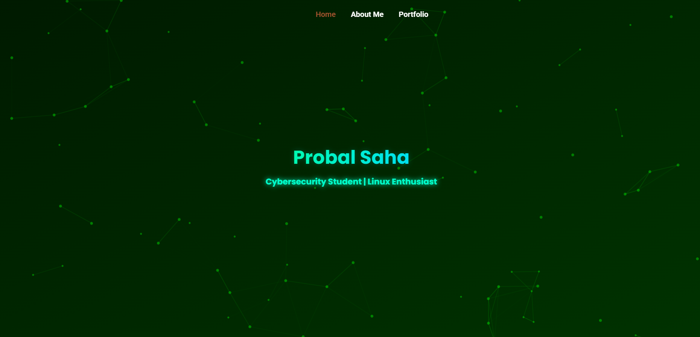

# 🛡 Probal Saha's Cyber Portfolio

Welcome to my personal *portfolio website*, crafted with a blend of creativity, cybersecurity aesthetics, and modern web design. Built using HTML, CSS, and JavaScript — fully responsive, animated, and powered by GitHub Pages.

> “I am the firewall to my own success — no malware, no hacker, no obstacle can break me.”

---

## 🖥 Live Demo

🔗 [View My Website](https://probalsentinel.github.io)

---

## 🚀 Features

- ✅ Matrix-style "Access Granted" welcome animation
- ✅ Floating header with cyber-particles
- ✅ Responsive tab navigation (desktop & mobile)
- ✅ Smooth section scrolling
- ✅ Skills, Certifications, Experience, Highlights
- ✅ Typing text animation & interactive cards
- ✅ Data driven via JSON for easy updates
- ✅ Hosted via GitHub Pages

---

---

## 🗂 Project Structure

bash
.
├── index.html              # Main HTML page
├── style.css               # All custom styles
├── script.js               # Interactive behavior
├── skills.json             # Skill data
├── certifications.json     # Certification data
├── images/                 # All static images & logos
└── README.md               # This file

## 📄 License
This project is licensed under a *Proprietary License*.  
All rights reserved © 2025 Probal Saha.

## 📬 Connect With Me

🚀 Check out my *Portfolio*: [Probal Saha - Portfolio](https://probalsentinel.github.io)  
📧 Email me at: [contact.probalsaha@gmail.com](mailto:contact.probalsaha@gmail.com)

   I love connecting with people! Feel free to reach out! 😊

---

⭐ Designed & Developed with ❤ by [@probalsentinel](https://github.com/probalsentinel)
